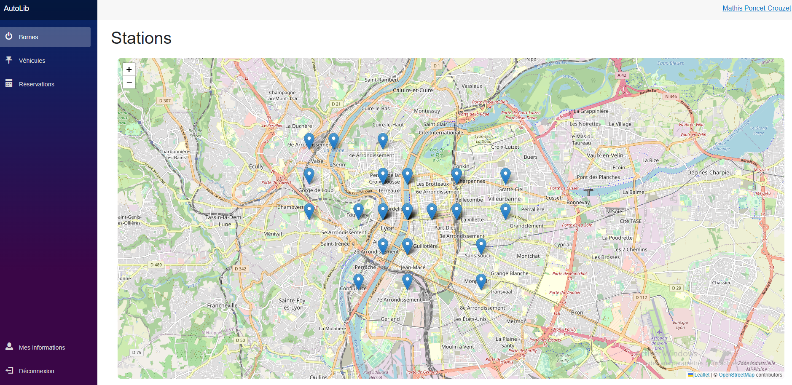
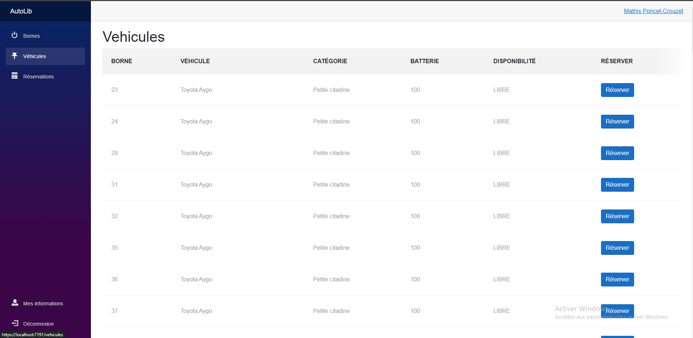
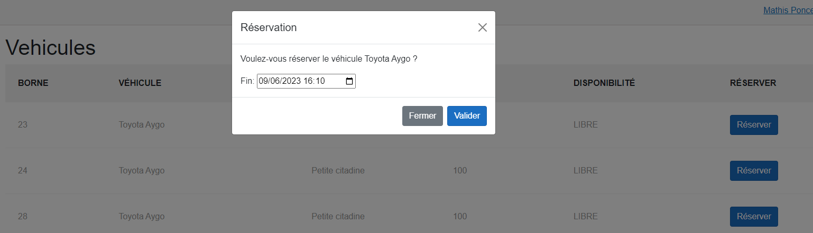
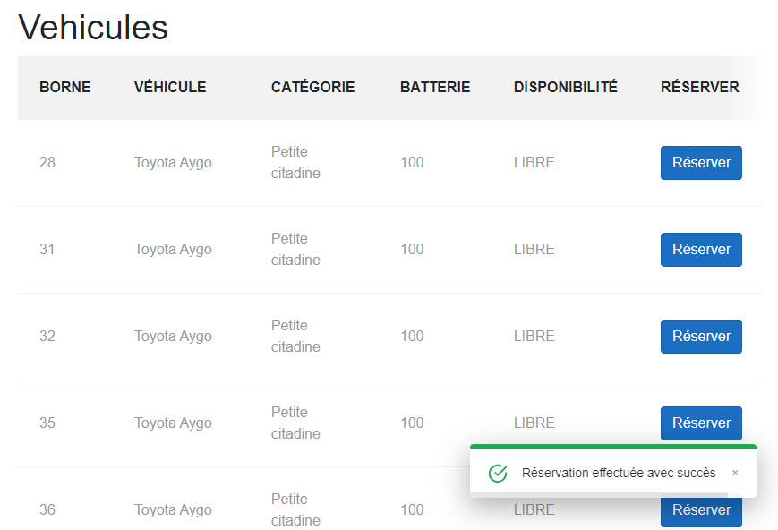
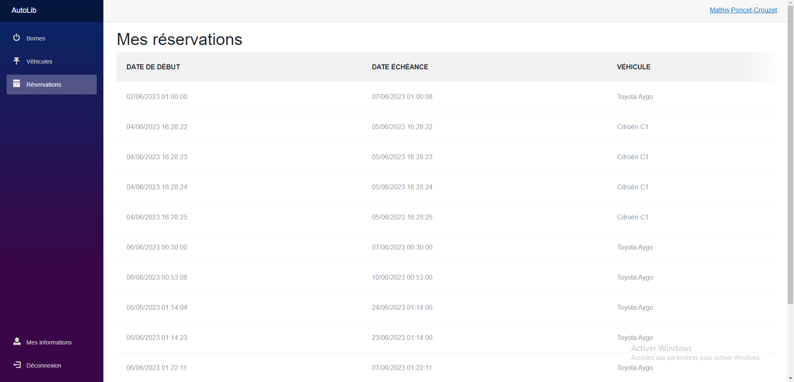
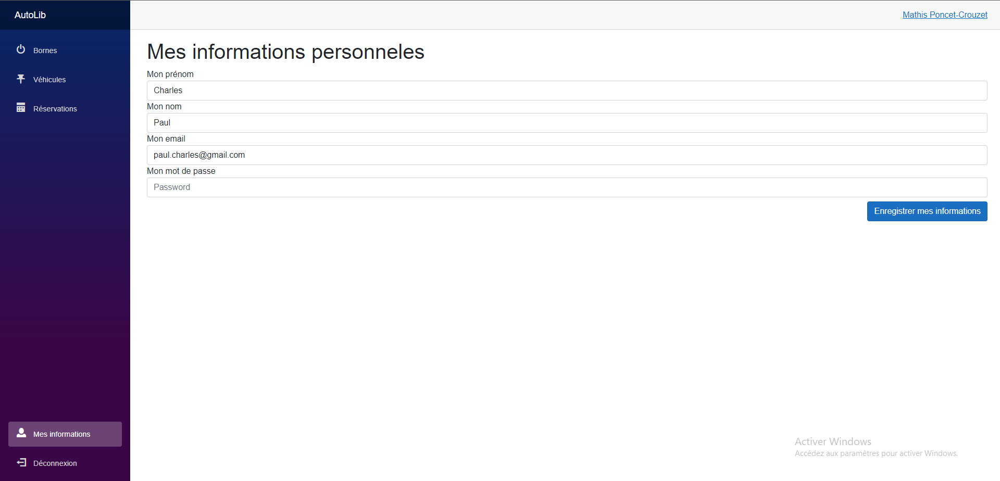
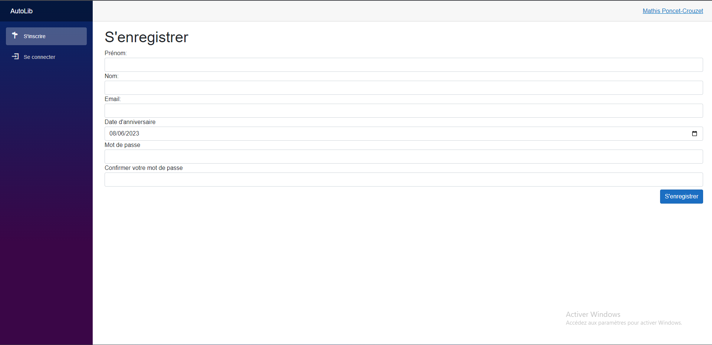
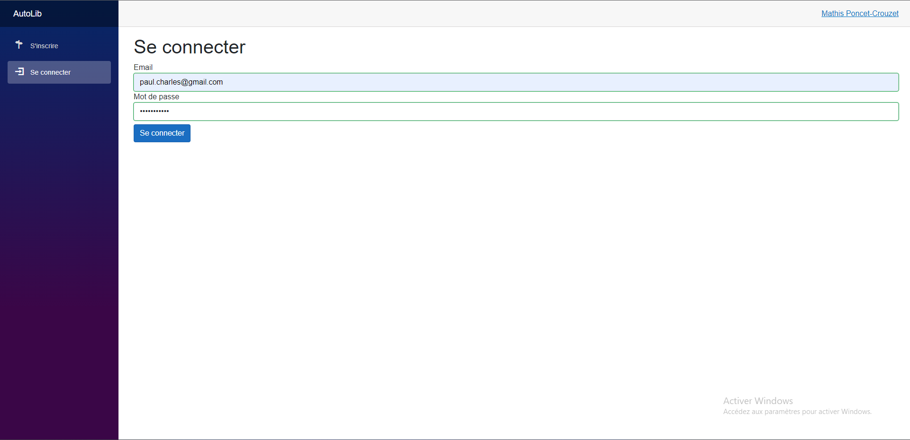

# Autolib

## Introduction

### Technologies

J'ai développé l'application en ASP.NET Core avec l'ORM Entity.
Pour la vue et le contrôleur, j'ai utilisé Blazor qui est une alternative à MVC et Razor Pages. C'est un framework
d'application (SPA) à une seule page qui se contente d'utiliser C# au lieu de JavaScript.

#### Authentification

Pour la partie d'authentification, j'ai utilisé la dépendance `Microsoft.AspNetCore.Identity.EntityFrameworkCore` qui
est
une partie du framework ASP.NET Core Identity. C'est une bibliothèque qui fournit une API pour l'authentification des
utilisateurs, y compris la fonctionnalité de vérification des mots de passe, le changement de mot de passe et
l'authentification à deux facteurs.

`ASP.NET Core Identity` utilise `Entity Framework Core` pour interagir avec la base de données. Ainsi, les informations
de
l'utilisateur sont stockées dans une base de données relationnelle qui peut être SQL Server, MySQL ou autre. La
bibliothèque Microsoft.AspNetCore.Identity.EntityFrameworkCore fournit également des tables prédéfinies pour gérer les
utilisateurs, les rôles, les revendications, etc.

## Fonctionnalités

### Quand l'utilisateur est connecté

Sur le site web, on retrouve une barre de navigation à gauche avec les liens des pages "Bornes", "Véhicules",
"Réservations", "Mes informations".

#### Visualisation des bornes



#### Réservation de véhicules

La réservation de véhicule s'effectue à partir de la date du jour jusqu'à une date de fin que l'utilisateur doit choisir

Lorsque l'utilisateur clique sur "Réserver", une boite de dialogue s'affiche avec la date de fin à indiquer.


Une fois une véhicule réservé, une notification s'affiche en bas à droite du site en vert afin d'indiquer à
l'utilisateur
que le véhicule a bien été reservé.


#### Visualisation de ses réservations



#### Visualisation de ses informations personnelles



### Quand l'utilisateur n'est pas connecté

L'utilisateur a la possibilité de s'inscrire et de se désinscrire

#### Inscription



#### Connexion



## Lancer le projet?

### Pré-requis

- Construire la base de données
    - Ouvrez PHPMyAdmin dans votre navigateur web.
        - Créez une nouvelle base de données avec le nom `autolib2`
        - Cliquez sur l'onglet "Importation".
        - Cliquez sur "Choisir un fichier" et sélectionnez le fichier SQL fourni.
            ```sql
          -- phpMyAdmin SQL Dump
          -- version 5.2.0
          -- https://www.phpmyadmin.net/
          --
          -- Hôte : 127.0.0.1
          -- Généré le : dim. 04 juin 2023 à 16:30
          -- Version du serveur : 10.4.24-MariaDB
          -- Version de PHP : 8.1.6
          
          SET SQL_MODE = "NO_AUTO_VALUE_ON_ZERO";
          START TRANSACTION;
          SET time_zone = "+00:00";
          
          
          /*!40101 SET @OLD_CHARACTER_SET_CLIENT=@@CHARACTER_SET_CLIENT */;
          /*!40101 SET @OLD_CHARACTER_SET_RESULTS=@@CHARACTER_SET_RESULTS */;
          /*!40101 SET @OLD_COLLATION_CONNECTION=@@COLLATION_CONNECTION */;
          /*!40101 SET NAMES utf8mb4 */;
          
          --
          -- Base de données : `autolib2`
          --
          
          -- --------------------------------------------------------
          
          --
          -- Structure de la table `aspnetroleclaims`
          --
          
          CREATE TABLE `aspnetroleclaims` (
            `Id` int(11) NOT NULL,
            `RoleId` varchar(255) NOT NULL,
            `ClaimType` longtext DEFAULT NULL,
            `ClaimValue` longtext DEFAULT NULL
          ) ENGINE=InnoDB DEFAULT CHARSET=utf8mb4;
          
          -- --------------------------------------------------------
          
          --
          -- Structure de la table `aspnetroles`
          --
          
          CREATE TABLE `aspnetroles` (
            `Id` varchar(255) NOT NULL,
            `Name` varchar(256) DEFAULT NULL,
            `NormalizedName` varchar(256) DEFAULT NULL,
            `ConcurrencyStamp` longtext DEFAULT NULL
          ) ENGINE=InnoDB DEFAULT CHARSET=utf8mb4;
          
          -- --------------------------------------------------------
          
          --
          -- Structure de la table `aspnetuserclaims`
          --
          
          CREATE TABLE `aspnetuserclaims` (
            `Id` int(11) NOT NULL,
            `UserId` varchar(255) NOT NULL,
            `ClaimType` longtext DEFAULT NULL,
            `ClaimValue` longtext DEFAULT NULL
          ) ENGINE=InnoDB DEFAULT CHARSET=utf8mb4;
          
          -- --------------------------------------------------------
          
          --
          -- Structure de la table `aspnetuserlogins`
          --
          
          CREATE TABLE `aspnetuserlogins` (
            `LoginProvider` varchar(255) NOT NULL,
            `ProviderKey` varchar(255) NOT NULL,
            `ProviderDisplayName` longtext DEFAULT NULL,
            `UserId` varchar(255) NOT NULL
          ) ENGINE=InnoDB DEFAULT CHARSET=utf8mb4;
          
          -- --------------------------------------------------------
          
          --
          -- Structure de la table `aspnetuserroles`
          --
          
          CREATE TABLE `aspnetuserroles` (
            `UserId` varchar(255) NOT NULL,
            `RoleId` varchar(255) NOT NULL
          ) ENGINE=InnoDB DEFAULT CHARSET=utf8mb4;
          
          -- --------------------------------------------------------
          
          --
          -- Structure de la table `aspnetusers`
          --
          
          CREATE TABLE `aspnetusers` (
            `Id` varchar(255) NOT NULL,
            `Nom` longtext NOT NULL,
            `Prenom` longtext NOT NULL,
            `DateNaissance` datetime(6) DEFAULT NULL,
            `UserName` varchar(256) DEFAULT NULL,
            `NormalizedUserName` varchar(256) DEFAULT NULL,
            `Email` varchar(256) DEFAULT NULL,
            `NormalizedEmail` varchar(256) DEFAULT NULL,
            `EmailConfirmed` tinyint(1) NOT NULL,
            `PasswordHash` longtext DEFAULT NULL,
            `SecurityStamp` longtext DEFAULT NULL,
            `ConcurrencyStamp` longtext DEFAULT NULL,
            `PhoneNumber` longtext DEFAULT NULL,
            `PhoneNumberConfirmed` tinyint(1) NOT NULL,
            `TwoFactorEnabled` tinyint(1) NOT NULL,
            `LockoutEnd` datetime(6) DEFAULT NULL,
            `LockoutEnabled` tinyint(1) NOT NULL,
            `AccessFailedCount` int(11) NOT NULL
          ) ENGINE=InnoDB DEFAULT CHARSET=utf8mb4;
          
          --
          -- Déchargement des données de la table `aspnetusers`
          --
          
          INSERT INTO `aspnetusers` (`Id`, `Nom`, `Prenom`, `DateNaissance`, `UserName`, `NormalizedUserName`, `Email`, `NormalizedEmail`, `EmailConfirmed`, `PasswordHash`, `SecurityStamp`, `ConcurrencyStamp`, `PhoneNumber`, `PhoneNumberConfirmed`, `TwoFactorEnabled`, `LockoutEnd`, `LockoutEnabled`, `AccessFailedCount`) VALUES
          ('c87b1868-935a-4c6c-b22b-98c88f834860', 'Charles', 'Paul', '2002-04-27 00:00:00.000000', 'paul.charles@gmail.com', 'PAUL.CHARLES@GMAIL.COM', 'paul.charles@gmail.com', 'PAUL.CHARLES@GMAIL.COM', 0, 'AQAAAAEAACcQAAAAEJC5lB6YLyWNAuWtDDD+neauPiO89kStSycHYz+mZqPVO9Uc3Nb7u8r5ppNNrDbRjg==', 'JJCCBPY3UL7ZWIF5RNM674GBNCFB7RPD', '6eaab2ab-98fd-4e62-9fea-d6e5a892b6d0', NULL, 0, 0, NULL, 1, 0);
          
          -- --------------------------------------------------------
          
          --
          -- Structure de la table `aspnetusertokens`
          --
          
          CREATE TABLE `aspnetusertokens` (
            `UserId` varchar(255) NOT NULL,
            `LoginProvider` varchar(255) NOT NULL,
            `Name` varchar(255) NOT NULL,
            `Value` longtext DEFAULT NULL
          ) ENGINE=InnoDB DEFAULT CHARSET=utf8mb4;
          
          -- --------------------------------------------------------
          
          --
          -- Structure de la table `borne`
          --
          
          CREATE TABLE `borne` (
            `IdBorne` int(11) NOT NULL,
            `IsFree` tinyint(1) NOT NULL,
            `IdVehicule` int(11) DEFAULT NULL,
            `IdStation` int(11) NOT NULL
          ) ENGINE=InnoDB DEFAULT CHARSET=utf8mb4;
          
          --
          -- Déchargement des données de la table `borne`
          --
          
          INSERT INTO `borne` (`IdBorne`, `IsFree`, `IdVehicule`, `IdStation`) VALUES
          (1, 0, 1, 1),
          (2, 0, 2, 1),
          (3, 1, NULL, 1),
          (4, 1, NULL, 1),
          (5, 0, 3, 2),
          (6, 0, 4, 2),
          (7, 0, 5, 2),
          (8, 1, NULL, 2),
          (9, 1, NULL, 2),
          (10, 1, NULL, 2),
          (11, 0, 6, 3),
          (12, 0, 7, 3),
          (13, 1, NULL, 3),
          (14, 1, NULL, 3),
          (15, 0, 8, 4),
          (16, 0, 9, 4),
          (17, 1, NULL, 4),
          (18, 1, NULL, 4),
          (19, 0, 10, 5),
          (20, 0, 11, 5),
          (21, 1, NULL, 5),
          (22, 1, NULL, 5),
          (23, 0, 12, 6),
          (24, 0, 13, 6),
          (25, 1, NULL, 6),
          (26, 1, NULL, 6),
          (27, 0, 14, 7),
          (28, 0, 15, 7),
          (29, 1, NULL, 7),
          (30, 1, NULL, 7),
          (31, 0, 16, 8),
          (32, 0, 17, 8),
          (33, 1, NULL, 8),
          (34, 1, NULL, 8),
          (35, 0, 18, 9),
          (36, 0, 19, 9),
          (37, 0, 20, 9),
          (38, 1, NULL, 9),
          (39, 1, NULL, 9),
          (40, 1, NULL, 9),
          (41, 0, 21, 10),
          (42, 0, 22, 10),
          (43, 0, 23, 10),
          (44, 0, 24, 10),
          (45, 1, NULL, 10),
          (46, 1, NULL, 10),
          (47, 1, NULL, 10),
          (48, 1, NULL, 10),
          (49, 0, 25, 11),
          (50, 1, NULL, 11),
          (51, 0, 26, 12),
          (52, 0, 27, 12),
          (53, 0, 28, 12),
          (54, 1, NULL, 12),
          (55, 1, NULL, 12),
          (56, 1, NULL, 12),
          (57, 0, 29, 13),
          (58, 0, 30, 13),
          (59, 0, 31, 13),
          (60, 1, NULL, 13),
          (61, 1, NULL, 13),
          (62, 1, NULL, 13),
          (63, 0, 32, 14),
          (64, 0, 33, 14),
          (65, 1, NULL, 14),
          (66, 1, NULL, 14),
          (67, 0, 34, 15),
          (68, 0, 35, 15),
          (69, 1, NULL, 15),
          (70, 1, NULL, 15),
          (71, 0, 36, 16),
          (72, 0, 37, 16),
          (73, 0, 38, 16),
          (74, 0, 39, 16),
          (75, 0, 40, 16),
          (76, 1, NULL, 16),
          (77, 1, NULL, 16),
          (78, 1, NULL, 16),
          (79, 1, NULL, 16),
          (80, 1, NULL, 16),
          (81, 0, 41, 17),
          (82, 0, 42, 17),
          (83, 0, 43, 17),
          (84, 0, 44, 17),
          (85, 1, NULL, 17),
          (86, 1, NULL, 17),
          (87, 1, NULL, 17),
          (88, 1, NULL, 17),
          (89, 0, 45, 18),
          (90, 0, 46, 18),
          (91, 0, 47, 18),
          (92, 1, NULL, 18),
          (93, 1, NULL, 18),
          (94, 1, NULL, 18),
          (95, 0, 48, 19),
          (96, 0, 49, 19),
          (97, 1, NULL, 19),
          (98, 1, NULL, 19),
          (99, 0, 50, 20),
          (100, 0, 51, 20),
          (101, 1, NULL, 20),
          (102, 1, NULL, 20),
          (103, 0, 52, 21),
          (104, 0, 53, 21),
          (105, 1, NULL, 21),
          (106, 1, NULL, 21),
          (107, 0, 54, 22),
          (108, 0, 55, 22),
          (109, 1, NULL, 22),
          (110, 1, NULL, 22),
          (111, 0, 56, 23),
          (112, 0, 57, 23),
          (113, 0, 58, 23),
          (114, 1, NULL, 23),
          (115, 1, NULL, 23),
          (116, 1, NULL, 23),
          (117, 0, 59, 24),
          (118, 0, 60, 24),
          (119, 0, 61, 24),
          (120, 1, NULL, 24),
          (121, 1, NULL, 24),
          (122, 1, NULL, 24),
          (123, 0, 62, 25),
          (124, 0, 63, 25),
          (125, 0, 64, 25),
          (126, 1, NULL, 25),
          (127, 1, NULL, 25),
          (128, 1, NULL, 25),
          (129, 0, 65, 26),
          (130, 1, NULL, 26),
          (131, 0, 66, 27),
          (132, 0, 67, 27),
          (133, 1, NULL, 27),
          (134, 1, NULL, 27),
          (135, 0, 68, 28),
          (136, 0, 69, 28),
          (137, 0, 70, 28),
          (138, 1, NULL, 28),
          (139, 1, NULL, 28),
          (140, 1, NULL, 28),
          (141, 0, 71, 29),
          (142, 0, 72, 29),
          (143, 1, NULL, 29),
          (144, 1, NULL, 29),
          (145, 0, 73, 30),
          (146, 0, 74, 30),
          (147, 0, 75, 30),
          (148, 1, NULL, 30),
          (149, 1, NULL, 30),
          (150, 1, NULL, 30),
          (151, 0, 76, 31),
          (152, 0, 77, 31),
          (153, 1, NULL, 31),
          (154, 1, NULL, 31),
          (155, 0, 78, 32),
          (156, 0, 79, 32),
          (157, 1, NULL, 32),
          (158, 1, NULL, 32),
          (159, 0, 80, 33),
          (160, 0, 81, 33),
          (161, 1, NULL, 33),
          (162, 1, NULL, 33),
          (163, 0, 82, 34),
          (164, 0, 83, 34),
          (165, 0, 84, 34),
          (166, 0, 85, 34),
          (167, 0, 86, 34),
          (168, 0, 87, 34),
          (169, 1, NULL, 34),
          (170, 1, NULL, 34),
          (171, 1, NULL, 34),
          (172, 1, NULL, 34),
          (173, 1, NULL, 34),
          (174, 1, NULL, 34),
          (175, 0, 88, 35),
          (176, 0, 89, 35),
          (177, 1, NULL, 35),
          (178, 1, NULL, 35);
          
          -- --------------------------------------------------------
          
          --
          -- Structure de la table `reservation`
          --
          
          CREATE TABLE `reservation` (
            `DateReservation` datetime(6) NOT NULL,
            `ClientId` varchar(255) NOT NULL,
            `VehiculeId` int(11) NOT NULL,
            `DateEcheance` datetime(6) DEFAULT NULL
          ) ENGINE=InnoDB DEFAULT CHARSET=utf8mb4;
          
          --
          -- Déchargement des données de la table `reservation`
          --
          
          INSERT INTO `reservation` (`DateReservation`, `ClientId`, `VehiculeId`, `DateEcheance`) VALUES
          ('2023-06-04 16:28:22.699121', 'c87b1868-935a-4c6c-b22b-98c88f834860', 14, '2023-06-05 16:28:22.699201'),
          ('2023-06-04 16:28:23.970469', 'c87b1868-935a-4c6c-b22b-98c88f834860', 57, '2023-06-05 16:28:23.970469'),
          ('2023-06-04 16:28:24.874636', 'c87b1868-935a-4c6c-b22b-98c88f834860', 61, '2023-06-05 16:28:24.874636'),
          ('2023-06-04 16:28:25.496189', 'c87b1868-935a-4c6c-b22b-98c88f834860', 69, '2023-06-05 16:28:25.496190');
          
          -- --------------------------------------------------------
          
          --
          -- Structure de la table `station`
          --
          
          CREATE TABLE `station` (
            `IdStation` int(11) NOT NULL,
            `Latitude` decimal(18,2) NOT NULL,
            `Longitude` decimal(18,2) NOT NULL,
            `Adresse` longtext DEFAULT NULL,
            `Numero` int(11) DEFAULT NULL,
            `Ville` longtext DEFAULT NULL,
            `CodePostal` int(11) DEFAULT NULL
          ) ENGINE=InnoDB DEFAULT CHARSET=utf8mb4;
          
          --
          -- Déchargement des données de la table `station`
          --
          
          INSERT INTO `station` (`IdStation`, `Latitude`, `Longitude`, `Adresse`, `Numero`, `Ville`, `CodePostal`) VALUES
          (1, '45.75', '4.87', 'Place Ambroise Courtois', 18, 'LYON', 69003),
          (2, '45.76', '4.84', 'Place Antonin Poncet', 1, 'LYON', 69002),
          (3, '45.74', '4.87', 'Place du 11 Novembre 1918', 1, 'LYON', 69008),
          (4, '45.75', '4.84', 'Rue de Marseille', 99, 'LYON', 69007),
          (5, '45.77', '4.86', 'Place Jules Ferry', 4, 'LYON', 69006),
          (6, '45.75', '4.83', 'Place Carnot', 1, 'LYON', 69002),
          (7, '45.76', '4.83', 'Place des Celestins', 11, 'LYON', 69001),
          (8, '45.74', '4.82', 'Cours Charlemagne', 79, 'LYON', 69002),
          (9, '45.77', '4.86', 'Cours Emile Zola', 25, 'VILLEURBANNE', 69100),
          (10, '45.76', '4.84', 'Rue Antoine Sallès', 13, 'LYON', 69002),
          (11, '45.76', '4.84', 'Rue Claudia', 18, 'LYON', 69002),
          (12, '45.78', '4.83', 'Rue de Belfort', 79, 'LYON', 69004),
          (13, '45.76', '4.84', 'Place Antonin Jutard', 1, 'LYON', 69003),
          (14, '45.78', '4.80', 'Rue du 24 mars', 16, 'LYON', 69009),
          (15, '45.77', '4.80', 'Rue de la Pépinière Royale', 1, 'LYON', 69009),
          (16, '45.77', '4.83', 'Boulevard de la Croix-Rousse', 167, 'LYON', 69004),
          (17, '45.77', '4.84', 'Place Louis Pradel', 1, 'LYON', 69001),
          (18, '45.77', '4.88', 'Rue Michel Servet', 30, 'VILLEURBANNE', 69100),
          (19, '45.74', '4.84', 'Avenue Jean Jaurès', 198, 'LYON', 69007),
          (20, '45.75', '4.84', 'Place Jean Macé', 1, 'LYON', 69007),
          (21, '45.76', '4.85', 'Rue Garibaldi', 156, 'LYON', 69003),
          (22, '45.76', '4.88', 'Rue Jean Jaurès', 3, 'VILLEURBANNE', 69100),
          (23, '45.77', '4.84', 'Place du Maréchal Lyautey', 11, 'LYON', 69006),
          (24, '45.76', '4.86', 'Rue Maurice Flandin', 33, 'LYON', 69003),
          (25, '45.76', '4.86', 'Rue Servient', 1, 'LYON', 69003),
          (26, '45.76', '4.80', 'Place des Compagnons de la Chansons', 1, 'LYON', 69005),
          (27, '45.76', '4.84', 'Rue de la République', 53, 'LYON', 69002),
          (28, '45.76', '4.83', 'Quai Saint-Antoine', 1, 'LYON', 69002),
          (29, '45.76', '4.83', 'Place Benoît Crepu', 6, 'LYON', 69005),
          (30, '45.76', '4.83', 'Quai Romain Rolland', 25, 'LYON', 69005),
          (31, '45.76', '4.82', 'Rue Trion', 40, 'LYON', 69005),
          (32, '45.77', '4.83', 'Place Sathonay', 5, 'LYON', 69001),
          (33, '45.76', '4.85', 'Avenue Maréchal de Saxe', 91, 'LYON', 69003),
          (34, '45.77', '4.83', 'Place des Terreaux', 23, 'LYON', 69001),
          (35, '45.78', '4.81', 'Rue du Sergent Michel Berthet', 2, 'LYON', 69009);
          
          -- --------------------------------------------------------
          
          --
          -- Structure de la table `typevehicule`
          --
          
          CREATE TABLE `typevehicule` (
            `IdTypeVehicule` int(11) NOT NULL,
            `Categorie` longtext NOT NULL,
            `Name` longtext NOT NULL
          ) ENGINE=InnoDB DEFAULT CHARSET=utf8mb4;
          
          --
          -- Déchargement des données de la table `typevehicule`
          --
          
          INSERT INTO `typevehicule` (`IdTypeVehicule`, `Categorie`, `Name`) VALUES
          (1, 'Petite citadine', 'Citroën C1'),
          (2, 'Petite citadine', 'Toyota Aygo'),
          (3, 'Utilitaire', 'Citroën Berlingo'),
          (4, 'Utilitaire', 'Citroën Berlingo PRM'),
          (5, 'Utilitaire', 'Nissan Evalia'),
          (6, 'Compacte', 'Toyota Yaris'),
          (7, 'Familliale', 'C4 Piccaso'),
          (8, 'Familliale', 'Toyota Verso');
          
          -- --------------------------------------------------------
          
          --
          -- Structure de la table `utilisationvehicule`
          --
          
          CREATE TABLE `utilisationvehicule` (
            `Id` varchar(255) NOT NULL,
            `Vehicule` int(11) NOT NULL,
            `Client` int(11) NOT NULL,
            `Date` datetime(6) NOT NULL,
            `BorneDepart` int(11) NOT NULL,
            `BorneArrivee` int(11) DEFAULT NULL,
            `IdVehicule` int(11) NOT NULL
          ) ENGINE=InnoDB DEFAULT CHARSET=utf8mb4;
          
          -- --------------------------------------------------------
          
          --
          -- Structure de la table `vehicule`
          --
          
          CREATE TABLE `vehicule` (
            `IdVehicule` int(11) NOT NULL,
            `Rfid` int(11) NOT NULL,
            `EtatBatterie` int(11) DEFAULT NULL,
            `Disponibilite` longtext NOT NULL,
            `Latitude` decimal(18,2) DEFAULT NULL,
            `Longitude` decimal(18,2) DEFAULT NULL,
            `IdTypeVehicule` int(11) NOT NULL
          ) ENGINE=InnoDB DEFAULT CHARSET=utf8mb4;
          
          --
          -- Déchargement des données de la table `vehicule`
          --
          
          INSERT INTO `vehicule` (`IdVehicule`, `Rfid`, `EtatBatterie`, `Disponibilite`, `Latitude`, `Longitude`, `IdTypeVehicule`) VALUES
          (1, 1234567891, 100, 'LIBRE', '45.75', '4.87', 2),
          (2, 1234567892, 100, 'LIBRE', '45.75', '4.87', 2),
          (3, 1234567893, 100, 'LIBRE', '45.76', '4.84', 2),
          (4, 1234567894, 100, 'LIBRE', '45.76', '4.84', 2),
          (5, 1234567895, 100, 'LIBRE', '45.76', '4.84', 3),
          (6, 1234567896, 100, 'LIBRE', '45.74', '4.87', 2),
          (7, 1234567897, 100, 'LIBRE', '45.74', '4.87', 2),
          (8, 1234567898, 100, 'LIBRE', '45.75', '4.84', 2),
          (9, 1234567899, 100, 'LIBRE', '45.75', '4.84', 5),
          (10, 1234567900, 100, 'LIBRE', '45.77', '4.86', 2),
          (11, 1234567901, 100, 'LIBRE', '45.77', '4.86', 2),
          (12, 1234567902, 100, 'LIBRE', '45.75', '4.83', 2),
          (13, 1234567903, 100, 'LIBRE', '45.75', '4.83', 2),
          (14, 1234567904, 100, 'RESERVE', '45.76', '4.83', 1),
          (15, 1234567905, 100, 'LIBRE', '45.76', '4.83', 2),
          (16, 1234567906, 100, 'LIBRE', '45.74', '4.82', 2),
          (17, 1234567907, 100, 'LIBRE', '45.74', '4.82', 2),
          (18, 1234567908, 100, 'LIBRE', '45.77', '4.86', 2),
          (19, 1234567909, 100, 'LIBRE', '45.77', '4.86', 2),
          (20, 1234567910, 100, 'LIBRE', '45.77', '4.86', 2),
          (21, 1234567911, 100, 'LIBRE', '45.76', '4.84', 2),
          (22, 1234567912, 100, 'LIBRE', '45.76', '4.84', 2),
          (23, 1234567913, 100, 'LIBRE', '45.76', '4.84', 5),
          (24, 1234567914, 100, 'LIBRE', '45.76', '4.84', 6),
          (25, 1234567915, 100, 'LIBRE', '45.76', '4.84', 4),
          (26, 1234567916, 100, 'LIBRE', '45.78', '4.83', 2),
          (27, 1234567917, 100, 'LIBRE', '45.78', '4.83', 5),
          (28, 1234567918, 100, 'LIBRE', '45.78', '4.83', 6),
          (29, 1234567919, 100, 'LIBRE', '45.76', '4.84', 2),
          (30, 1234567920, 100, 'LIBRE', '45.76', '4.84', 2),
          (31, 1234567921, 100, 'LIBRE', '45.76', '4.84', 8),
          (32, 1234567922, 100, 'LIBRE', '45.78', '4.80', 2),
          (33, 1234567923, 100, 'LIBRE', '45.78', '4.80', 2),
          (34, 1234567924, 100, 'LIBRE', '45.77', '4.80', 2),
          (35, 1234567925, 100, 'LIBRE', '45.77', '4.80', 2),
          (36, 1234567926, 100, 'LIBRE', '45.77', '4.83', 2),
          (37, 1234567927, 100, 'LIBRE', '45.77', '4.83', 2),
          (38, 1234567928, 100, 'LIBRE', '45.77', '4.83', 2),
          (39, 1234567929, 100, 'LIBRE', '45.77', '4.83', 3),
          (40, 1234567930, 100, 'LIBRE', '45.77', '4.83', 6),
          (41, 1234567931, 100, 'LIBRE', '45.77', '4.84', 2),
          (42, 1234567932, 100, 'LIBRE', '45.77', '4.84', 2),
          (43, 1234567933, 100, 'LIBRE', '45.77', '4.84', 2),
          (44, 1234567934, 100, 'LIBRE', '45.77', '4.84', 5),
          (45, 1234567935, 100, 'LIBRE', '45.77', '4.84', 8),
          (46, 1234567936, 100, 'LIBRE', '45.77', '4.88', 2),
          (47, 1234567937, 100, 'LIBRE', '45.77', '4.88', 2),
          (48, 1234567938, 100, 'LIBRE', '45.77', '4.88', 5),
          (49, 1234567939, 100, 'LIBRE', '45.74', '4.84', 2),
          (50, 1234567940, 100, 'LIBRE', '45.74', '4.84', 2),
          (51, 1234567941, 100, 'LIBRE', '45.75', '4.84', 2),
          (52, 1234567942, 100, 'LIBRE', '45.75', '4.84', 2),
          (53, 1234567943, 100, 'LIBRE', '45.76', '4.85', 2),
          (54, 1234567944, 100, 'LIBRE', '45.76', '4.85', 6),
          (55, 1234567945, 100, 'LIBRE', '45.76', '4.88', 2),
          (56, 1234567946, 100, 'LIBRE', '45.76', '4.88', 2),
          (57, 1234567947, 100, 'RESERVE', '45.77', '4.84', 1),
          (58, 1234567948, 100, 'LIBRE', '45.77', '4.84', 2),
          (59, 1234567949, 100, 'LIBRE', '45.77', '4.84', 6),
          (60, 1234567950, 100, 'LIBRE', '45.76', '4.86', 2),
          (61, 1234567951, 100, 'RESERVE', '45.76', '4.86', 1),
          (62, 1234567952, 100, 'LIBRE', '45.76', '4.86', 8),
          (63, 1234567953, 100, 'LIBRE', '45.76', '4.86', 2),
          (64, 1234567954, 100, 'LIBRE', '45.76', '4.86', 2),
          (65, 1234567955, 100, 'LIBRE', '45.76', '4.86', 7),
          (66, 1234567956, 100, 'LIBRE', '45.76', '4.80', 2),
          (67, 1234567957, 100, 'LIBRE', '45.76', '4.84', 2),
          (68, 1234567958, 100, 'LIBRE', '45.76', '4.84', 6),
          (69, 1234567959, 100, 'RESERVE', '45.76', '4.83', 1),
          (70, 1234567960, 100, 'LIBRE', '45.76', '4.83', 3),
          (71, 1234567961, 100, 'LIBRE', '45.76', '4.83', 8),
          (72, 1234567962, 100, 'LIBRE', '45.76', '4.83', 2),
          (73, 1234567963, 100, 'LIBRE', '45.76', '4.83', 3),
          (74, 1234567964, 100, 'LIBRE', '45.76', '4.83', 2),
          (75, 1234567965, 100, 'LIBRE', '45.76', '4.83', 2),
          (76, 1234567966, 100, 'LIBRE', '45.76', '4.83', 6),
          (77, 1234567967, 100, 'LIBRE', '45.76', '4.82', 2),
          (78, 1234567968, 100, 'LIBRE', '45.76', '4.82', 2),
          (79, 1234567969, 100, 'LIBRE', '45.77', '4.83', 2),
          (80, 1234567970, 100, 'LIBRE', '45.77', '4.83', 2),
          (81, 1234567971, 100, 'LIBRE', '45.76', '4.85', 2),
          (82, 1234567972, 100, 'LIBRE', '45.76', '4.85', 2),
          (83, 1234567973, 100, 'LIBRE', '45.77', '4.83', 2),
          (84, 1234567974, 100, 'LIBRE', '45.77', '4.83', 2),
          (85, 1234567975, 100, 'LIBRE', '45.77', '4.83', 2),
          (86, 1234567976, 100, 'LIBRE', '45.77', '4.83', 5),
          (87, 1234567977, 100, 'LIBRE', '45.77', '4.83', 6),
          (88, 1234567978, 100, 'LIBRE', '45.78', '4.81', 2),
          (89, 1234567979, 100, 'LIBRE', '45.78', '4.81', 2);
          
          -- --------------------------------------------------------
          
          --
          -- Structure de la table `__efmigrationshistory`
          --
          
          CREATE TABLE `__efmigrationshistory` (
            `MigrationId` varchar(150) NOT NULL,
            `ProductVersion` varchar(32) NOT NULL
          ) ENGINE=InnoDB DEFAULT CHARSET=utf8mb4;
          
          --
          -- Déchargement des données de la table `__efmigrationshistory`
          --
          
          INSERT INTO `__efmigrationshistory` (`MigrationId`, `ProductVersion`) VALUES
          ('20230529141449_InitialMigration', '6.0.16');
          
          --
          -- Index pour les tables déchargées
          --
          
          --
          -- Index pour la table `aspnetroleclaims`
          --
          ALTER TABLE `aspnetroleclaims`
            ADD PRIMARY KEY (`Id`),
            ADD KEY `IX_AspNetRoleClaims_RoleId` (`RoleId`);
          
          --
          -- Index pour la table `aspnetroles`
          --
          ALTER TABLE `aspnetroles`
            ADD PRIMARY KEY (`Id`),
            ADD UNIQUE KEY `RoleNameIndex` (`NormalizedName`);
          
          --
          -- Index pour la table `aspnetuserclaims`
          --
          ALTER TABLE `aspnetuserclaims`
            ADD PRIMARY KEY (`Id`),
            ADD KEY `IX_AspNetUserClaims_UserId` (`UserId`);
          
          --
          -- Index pour la table `aspnetuserlogins`
          --
          ALTER TABLE `aspnetuserlogins`
            ADD PRIMARY KEY (`LoginProvider`,`ProviderKey`),
            ADD KEY `IX_AspNetUserLogins_UserId` (`UserId`);
          
          --
          -- Index pour la table `aspnetuserroles`
          --
          ALTER TABLE `aspnetuserroles`
            ADD PRIMARY KEY (`UserId`,`RoleId`),
            ADD KEY `IX_AspNetUserRoles_RoleId` (`RoleId`);
          
          --
          -- Index pour la table `aspnetusers`
          --
          ALTER TABLE `aspnetusers`
            ADD PRIMARY KEY (`Id`),
            ADD UNIQUE KEY `UserNameIndex` (`NormalizedUserName`),
            ADD KEY `EmailIndex` (`NormalizedEmail`);
          
          --
          -- Index pour la table `aspnetusertokens`
          --
          ALTER TABLE `aspnetusertokens`
            ADD PRIMARY KEY (`UserId`,`LoginProvider`,`Name`);
          
          --
          -- Index pour la table `borne`
          --
          ALTER TABLE `borne`
            ADD PRIMARY KEY (`IdBorne`),
            ADD KEY `IX_Borne_IdStation` (`IdStation`),
            ADD KEY `IX_Borne_IdVehicule` (`IdVehicule`);
          
          --
          -- Index pour la table `reservation`
          --
          ALTER TABLE `reservation`
            ADD PRIMARY KEY (`DateReservation`,`ClientId`,`VehiculeId`),
            ADD KEY `IX_Reservation_ClientId` (`ClientId`),
            ADD KEY `IX_Reservation_VehiculeId` (`VehiculeId`);
          
          --
          -- Index pour la table `station`
          --
          ALTER TABLE `station`
            ADD PRIMARY KEY (`IdStation`);
          
          --
          -- Index pour la table `typevehicule`
          --
          ALTER TABLE `typevehicule`
            ADD PRIMARY KEY (`IdTypeVehicule`);
          
          --
          -- Index pour la table `utilisationvehicule`
          --
          ALTER TABLE `utilisationvehicule`
            ADD PRIMARY KEY (`Id`),
            ADD KEY `IX_UtilisationVehicule_BorneArrivee` (`BorneArrivee`),
            ADD KEY `IX_UtilisationVehicule_BorneDepart` (`BorneDepart`),
            ADD KEY `IX_UtilisationVehicule_IdVehicule` (`IdVehicule`);
          
          --
          -- Index pour la table `vehicule`
          --
          ALTER TABLE `vehicule`
            ADD PRIMARY KEY (`IdVehicule`),
            ADD KEY `IX_Vehicule_IdTypeVehicule` (`IdTypeVehicule`);
          
          --
          -- Index pour la table `__efmigrationshistory`
          --
          ALTER TABLE `__efmigrationshistory`
            ADD PRIMARY KEY (`MigrationId`);
          
          --
          -- AUTO_INCREMENT pour les tables déchargées
          --
          
          --
          -- AUTO_INCREMENT pour la table `aspnetroleclaims`
          --
          ALTER TABLE `aspnetroleclaims`
            MODIFY `Id` int(11) NOT NULL AUTO_INCREMENT;
          
          --
          -- AUTO_INCREMENT pour la table `aspnetuserclaims`
          --
          ALTER TABLE `aspnetuserclaims`
            MODIFY `Id` int(11) NOT NULL AUTO_INCREMENT;
          
          --
          -- AUTO_INCREMENT pour la table `borne`
          --
          ALTER TABLE `borne`
            MODIFY `IdBorne` int(11) NOT NULL AUTO_INCREMENT, AUTO_INCREMENT=179;
          
          --
          -- AUTO_INCREMENT pour la table `station`
          --
          ALTER TABLE `station`
            MODIFY `IdStation` int(11) NOT NULL AUTO_INCREMENT, AUTO_INCREMENT=36;
          
          --
          -- AUTO_INCREMENT pour la table `typevehicule`
          --
          ALTER TABLE `typevehicule`
            MODIFY `IdTypeVehicule` int(11) NOT NULL AUTO_INCREMENT, AUTO_INCREMENT=9;
          
          --
          -- AUTO_INCREMENT pour la table `vehicule`
          --
          ALTER TABLE `vehicule`
            MODIFY `IdVehicule` int(11) NOT NULL AUTO_INCREMENT, AUTO_INCREMENT=90;
          
          --
          -- Contraintes pour les tables déchargées
          --
          
          --
          -- Contraintes pour la table `aspnetroleclaims`
          --
          ALTER TABLE `aspnetroleclaims`
            ADD CONSTRAINT `FK_AspNetRoleClaims_AspNetRoles_RoleId` FOREIGN KEY (`RoleId`) REFERENCES `aspnetroles` (`Id`) ON DELETE CASCADE;
          
          --
          -- Contraintes pour la table `aspnetuserclaims`
          --
          ALTER TABLE `aspnetuserclaims`
            ADD CONSTRAINT `FK_AspNetUserClaims_AspNetUsers_UserId` FOREIGN KEY (`UserId`) REFERENCES `aspnetusers` (`Id`) ON DELETE CASCADE;
          
          --
          -- Contraintes pour la table `aspnetuserlogins`
          --
          ALTER TABLE `aspnetuserlogins`
            ADD CONSTRAINT `FK_AspNetUserLogins_AspNetUsers_UserId` FOREIGN KEY (`UserId`) REFERENCES `aspnetusers` (`Id`) ON DELETE CASCADE;
          
          --
          -- Contraintes pour la table `aspnetuserroles`
          --
          ALTER TABLE `aspnetuserroles`
            ADD CONSTRAINT `FK_AspNetUserRoles_AspNetRoles_RoleId` FOREIGN KEY (`RoleId`) REFERENCES `aspnetroles` (`Id`) ON DELETE CASCADE,
            ADD CONSTRAINT `FK_AspNetUserRoles_AspNetUsers_UserId` FOREIGN KEY (`UserId`) REFERENCES `aspnetusers` (`Id`) ON DELETE CASCADE;
          
          --
          -- Contraintes pour la table `aspnetusertokens`
          --
          ALTER TABLE `aspnetusertokens`
            ADD CONSTRAINT `FK_AspNetUserTokens_AspNetUsers_UserId` FOREIGN KEY (`UserId`) REFERENCES `aspnetusers` (`Id`) ON DELETE CASCADE;
          
          --
          -- Contraintes pour la table `borne`
          --
          ALTER TABLE `borne`
            ADD CONSTRAINT `FK_Borne_Station_IdStation` FOREIGN KEY (`IdStation`) REFERENCES `station` (`IdStation`) ON DELETE CASCADE,
            ADD CONSTRAINT `FK_Borne_Vehicule_IdVehicule` FOREIGN KEY (`IdVehicule`) REFERENCES `vehicule` (`IdVehicule`);
          
          --
          -- Contraintes pour la table `reservation`
          --
          ALTER TABLE `reservation`
            ADD CONSTRAINT `FK_Reservation_AspNetUsers_ClientId` FOREIGN KEY (`ClientId`) REFERENCES `aspnetusers` (`Id`) ON DELETE CASCADE,
            ADD CONSTRAINT `FK_Reservation_Vehicule_VehiculeId` FOREIGN KEY (`VehiculeId`) REFERENCES `vehicule` (`IdVehicule`) ON DELETE CASCADE;
          
          --
          -- Contraintes pour la table `utilisationvehicule`
          --
          ALTER TABLE `utilisationvehicule`
            ADD CONSTRAINT `FK_UtilisationVehicule_AspNetUsers_Id` FOREIGN KEY (`Id`) REFERENCES `aspnetusers` (`Id`) ON DELETE CASCADE,
            ADD CONSTRAINT `FK_UtilisationVehicule_Borne_BorneArrivee` FOREIGN KEY (`BorneArrivee`) REFERENCES `borne` (`IdBorne`),
            ADD CONSTRAINT `FK_UtilisationVehicule_Borne_BorneDepart` FOREIGN KEY (`BorneDepart`) REFERENCES `borne` (`IdBorne`) ON DELETE CASCADE,
            ADD CONSTRAINT `FK_UtilisationVehicule_Vehicule_IdVehicule` FOREIGN KEY (`IdVehicule`) REFERENCES `vehicule` (`IdVehicule`) ON DELETE CASCADE;
          
          --
          -- Contraintes pour la table `vehicule`
          --
          ALTER TABLE `vehicule`
            ADD CONSTRAINT `FK_Vehicule_TypeVehicule_IdTypeVehicule` FOREIGN KEY (`IdTypeVehicule`) REFERENCES `typevehicule` (`IdTypeVehicule`) ON DELETE CASCADE;
          COMMIT;
          
          /*!40101 SET CHARACTER_SET_CLIENT=@OLD_CHARACTER_SET_CLIENT */;
          /*!40101 SET CHARACTER_SET_RESULTS=@OLD_CHARACTER_SET_RESULTS */;
          /*!40101 SET COLLATION_CONNECTION=@OLD_COLLATION_CONNECTION */;
          ```
        - Cliquez sur "Exécuter" pour importer les données dans `autolib2`

- Lancer le projet
    - Ouvrez le projet dans Visual Studio
    - Cliquez sur "Exécuter" pour lancer le projet
    - Le projet devrait s'ouvrir dans votre navigateur par défaut
- Pour vous connecter en tant qu'utilisateur
    - email : `paul.charles@gmail.com`
    - mot de passe : `SuperMDP71.`
    